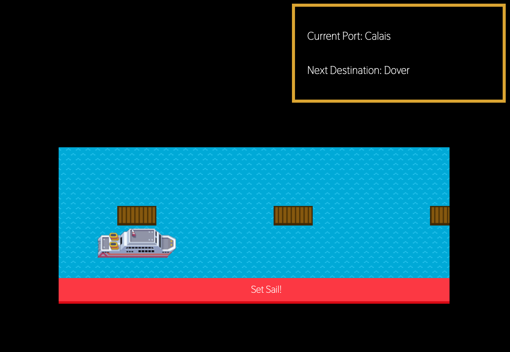

# Cruise ships project

A pair-programmed JavaScript project as part of the Software Engineering Fasttrack course at Manchester Codes. We have created the JavaScript code to simulate cruise ships sailing around the world and docking at ports along the way. As a latter stage of the project we have added a Graphical User Interface to display the cruise ships, ports and journeys in the browser.

## General info

The purpose of this project is to build upon the following skills and concepts:

* Domain Modelling
* User stories
* Object-oriented Programming
* DRY
* Single Responsibility Principle
* Dependency inversion
* Test doubles and test isolation
* DOM manipulation

## Technologies

* JavaScript
* Jest
* Node
* Node Package Manager
* Git
* GitHub
* HTML
* CSS
* Normalize.css
* ESLint

## Features

There are three classes that can interact with each other to simulate cruise ships as they travel around the globe.

Ship objects will have itinerary and port objects. Ships can set sail and dock at ports. Ports hold records of the ships currently docked. Itineraries contain information about the current and previous ports.

All of this is visually respresented by a Graphical User Interface, which includes an animated sea background, multiple 'ports' and a ship icon. With the click of a button, the user is able to launch the ship and sail from port to port.

## Status

Project status: _in progress_

## Contributors

Project created by Jennifer Cant and Jennifer Openshaw.